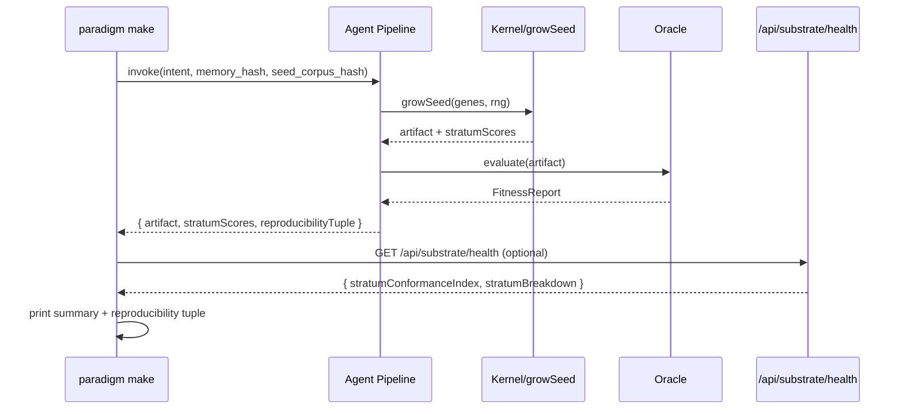
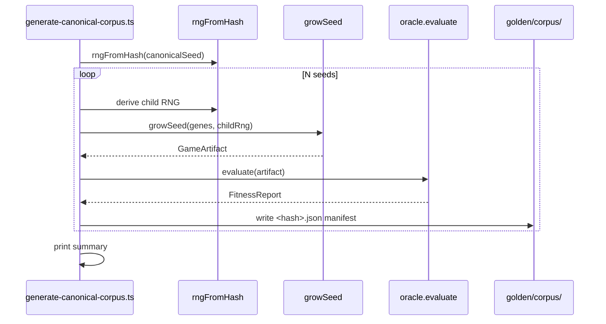

# Design Document: Paradigm Full Completion (Phases 1–15)

## Overview

This document captures the technical design for closing Phase 1 and advancing through Phase 15 of the Paradigm Absolute platform. The Spine — determinism, sovereignty, quality — is the non-negotiable invariant that every decision below is subordinated to.

The platform is at a well-advanced state: `server.ts` is 630 LOC (gate requires ≤500), 9 stratum contracts exist with partial predicate coverage, the `QualityContract` interface already has `strata` and `manifest()` fields, `encodeGseed`/`signGseed` exist in `binary-format.ts`, and the `doctrine-gates` CI job exists but needs threshold tightening and additional gate steps.

All 15 requirements are addressed in dependency order across six implementation waves.

---

## Architecture

```mermaid
graph TD
    A[server.ts ≤500 LOC] --> B[src/server/routes/*]
    C[CI doctrine-gates] --> D[8 hard-blocking gates]
    E[9 Stratum Contracts] --> F[≥6 axes each]
    F --> G[/api/substrate/health SCI]
    H[QualityContract interface] --> I[strata + manifest fields]
    I --> G
    J[Agent Pipeline] --> K[memory_hash + seed_corpus_hash]
    K --> L[paradigm make output]
    M[Corpus Generator] --> N[golden/corpus/<hash>.json]
    N --> O[Corpus Regression Gate CI]
    P[12 Flagship .gseed files] --> Q[.paradigm/flagships/<id>.gseed]
    R[Studio Surface] --> S[WCAG 2.2 AA]
    R --> T[Onboarding Funnel ≤60s]
```

---

## Req 1: Server Modular Split

### Current State

`server.ts` is 630 LOC. The `register*Routes(app)` pattern is fully established — 30 route modules already exist in `src/server/routes/`. The remaining inline handler is the `/api/substrate/health` GET at the top of `startServer()` (lines ~200–230), which duplicates the logic already in `src/server/routes/substrate-health.ts`.

### Design

Remove the inline `/api/substrate/health` handler from `server.ts` and rely solely on `registerSubstrateHealthRoutes(app)` which is already called later in the file. Audit remaining LOC after removal; if still above 500, extract the Prometheus metrics middleware block into `src/server/routes/metrics-middleware.ts`.

**Target:** `wc -l server.ts` ≤ 500 after extraction.

**Extraction pattern (already established):**
```typescript
// server.ts — only bootstrap, middleware, and register* calls remain
registerSubstrateHealthRoutes(app);  // already present — remove duplicate inline handler above
```

**Constraints:**
- Preserve exact HTTP method, path, request body schema, and response shape of every extracted handler.
- No circular imports: extracted modules receive deps via the typed deps interface pattern.
- `server.ts` retains: port binding, middleware registration, WebSocket upgrade, graceful shutdown.


---

## Req 2: CI Doctrine Gates Hardening

### Current State

The `doctrine-gates` job in `.github/workflows/ci.yml` runs: typecheck, determinism, GSPL interpreter, canonical-rename, no-evasion, preflight report, and a golden hash spot check. Missing: `test:stratum-contracts`, `test:golden-hash` (as a hard gate, not `|| true`), and a `paradigm make` smoke test. The `no-evasion` threshold is 150 (should be 0 after batch waivers).

### Design

Add three steps to the `doctrine-gates` job:

```yaml
- name: Stratum Contracts (hard gate)
  run: npx vitest run tests/contracts/

- name: Golden Hash Verify (hard gate)
  run: npm run golden:verify

- name: paradigm make smoke test (hard gate)
  run: npx tsx scripts/paradigm.ts make "a lone monk who paints with living sound" --domain music
  timeout-minutes: 3
```

Tighten the `no-evasion` step to `--max-unwaived 0` (after batch waivers are subtracted by the linter reading `docs/waivers/registry.json`).

Add expired-waiver detection: the linter already reads `docs/waivers/registry.json`; add a CI step that fails if any entry's `sunset` date has passed.

**Gate order (all blocking):**
1. `typecheck:strict` — `npx tsc --noEmit`
2. `determinism` — `npm run determinism:check`
3. `canonical-rename` — threshold ≤8 unwaived (Phase 2 target: 0)
4. `no-evasion` — threshold 0 unwaived after batch waivers
5. `test:determinism` — `npx vitest run tests/determinism/`
6. `test:composition` — `npx vitest run tests/composition/`
7. `test:golden-hash` — `npm run golden:verify` (hard fail, no `|| true`)
8. `test:stratum-contracts` — `npx vitest run tests/contracts/`
9. `paradigm make` smoke — canonical intent, non-zero exit on failure


---

## Req 3: Stratum Predicate Expansion

### Current State

Nine stratum files exist in `src/lib/contracts/strata/`: `form.ts`, `motion.ts`, `sound.ts`, `world.ts`, `mind.ts`, `story.ts`, `field.ts`, `culture.ts`, `time.ts`. The `predicates.ts` file in `src/lib/kernel/quality/` already imports from these and has real executable bodies for all 9 strata with 6–10 axes each.

The requirements use different stratum names than the codebase: the requirements say Form/Motion/Sound/Space/Time/Structure/Semantics/Culture/Possibility, while the codebase uses Form/Motion/Sound/World/Time/Field/Story/Culture/Mind. The mapping is:

| Requirements Name | Codebase Name | File |
|---|---|---|
| Form | Form | `form.ts` |
| Motion | Motion | `motion.ts` |
| Sound | Sound | `sound.ts` |
| Space | World | `world.ts` |
| Time | Time | `time.ts` |
| Structure | Field | `field.ts` |
| Semantics | Story | `story.ts` |
| Culture | Culture | `culture.ts` |
| Possibility | Mind | `mind.ts` |

### Design

Each stratum contract file in `src/lib/contracts/strata/` needs to expose ≥6 named, individually callable predicate axis functions (not just a single `evaluate()` method). The `predicates.ts` file already has the logic; the task is to expose each axis as a named export so tests can call them individually.

**Pattern for each stratum file:**
```typescript
// src/lib/contracts/strata/form.ts — add named axis exports
export function symmetryScore(artifact: any): number { ... }
export function complexityScore(artifact: any): number { ... }
export function boundingBoxAspectRatio(artifact: any): number { ... }
export function vertexDensity(artifact: any): number { ... }
export function curvatureVariance(artifact: any): number { ... }
export function topologicalGenus(artifact: any): number { ... }
```

Each axis function: returns `number` in `[0, 1]`, never throws, returns `0` for null/undefined input.

**Tests:** `tests/contracts/<stratum>.test.ts` — ≥1 test per axis function, covering valid input, null input, and boundary values.


---

## Req 4: Stratum Conformance Index

### Current State

`/api/substrate/health` exists in `src/server/routes/substrate-health.ts`. It already calls `calculateStratumConformance` and returns `predicateDemo` with per-stratum scores. Missing: a top-level `stratumConformanceIndex` field (0–1 scalar) and a `stratumBreakdown` array with per-stratum passing/failing generator counts.

### Design

Extend the `/api/substrate/health` response shape:

```typescript
interface SubstrateHealthResponse {
  // existing fields...
  stratumConformanceIndex: number;        // 0..1 — fraction of generators passing all declared strata
  stratumBreakdown: StratumBreakdownEntry[];
  // existing predicateDemo, strata, metrics, etc.
}

interface StratumBreakdownEntry {
  stratum: string;
  passingGenerators: number;
  totalGenerators: number;
  conformanceScore: number;              // 0..1
  failingGeneratorIds: string[];
  failingPredicateAxes: string[];
}
```

**SCI Calculation:**
```
SCI = (generators passing ALL declared strata predicates) / (total registered generators)
```

The calculation iterates `listContracts()` from `quality-contract.ts`, runs each contract's declared strata through `runStratumPredicate()` on the contract's first curated seed, and counts pass/fail per stratum.

**Performance:** The endpoint must respond within 5000ms. Cache the SCI calculation for 30 seconds using the existing in-memory cache layer.

**CLI integration:** `paradigm make` prints `stratumConformanceIndex` and per-stratum summary if available; degrades gracefully if the health endpoint is unreachable.


---

## Req 5: Tier-1 Generator Stratum Wiring

### Current State

`QualityContract<TSeed, TArtifact, TGenes>` in `src/lib/kernel/quality-contract.ts` already has `readonly strata?: readonly Stratum[]` and `manifest?()`. The `strata` field is optional during Phase 1 sweep. The 12 flagship generators (`friend`, `world`, `game`, `music`, `character`, `visual2d`, `sprite`, `narrative`, `audio`, `animation`, `shader`, `typography`) need `strata` declared and `stratumScores` in their artifact output.

### Design

**Step 1: Make `strata` required on `QualityContract`** (after sweep is complete):
```typescript
readonly strata: readonly Stratum[];  // remove the `?`
```

**Step 2: Add `stratumScores` to artifact types:**
```typescript
interface StratumArtifact {
  stratumScores: Partial<Record<Stratum, number>>;  // populated by applicable predicate axes
}
```

**Step 3: Wire each Tier-1 generator's `synthesize()` to populate `stratumScores`:**
```typescript
// In each generator's synthesize():
const stratumScores: Partial<Record<Stratum, number>> = {};
for (const stratum of this.strata) {
  const result = runStratumPredicate(stratum, artifact);
  stratumScores[stratum] = result.score;
}
return { ...artifact, stratumScores };
```

**Step 4: `manifest()` returns:**
```typescript
manifest() {
  return {
    domain: this.domain,
    version: this.version,
    strata: this.strata,
    clauses: ['synthesize', 'invert', 'rate', 'curate', 'deterministic'],
    determinism: 'strict',
  };
}
```

**Tier-1 generators and their primary strata:**

| Generator | Primary Strata |
|---|---|
| `friend` | Form, Mind, Culture |
| `world` | World, Time, Culture |
| `game` | Mind, Story, Field |
| `music` | Sound, Time |
| `character` | Form, Motion, Culture |
| `visual2d` | Form |
| `sprite` | Form, Motion |
| `narrative` | Story, Time, Culture |
| `audio` | Sound |
| `animation` | Motion, Time |
| `shader` | Form, Field |
| `typography` | Form, Culture |


---

## Req 6: Agent Reproducibility Harness

### Current State

`src/lib/agent/` contains the agent pipeline. The `rngFromHash` / SHA-256 mechanism exists in `src/lib/kernel/rng.ts`. No `memory_hash` or `seed_corpus_hash` are currently computed or logged.

### Design

**Reproducibility tuple:** `(intent: string, memory_hash: string, seed_corpus_hash: string)`

**Hash computation (deterministic, no wall-clock):**
```typescript
import { createHash } from 'crypto';

function computeMemoryHash(memoryState: unknown): string {
  return createHash('sha256')
    .update(JSON.stringify(memoryState, Object.keys(memoryState as object).sort()))
    .digest('hex');
}

function computeSeedCorpusHash(seeds: unknown[]): string {
  const sorted = [...seeds].sort((a: any, b: any) =>
    (a.$hash || a.id || '').localeCompare(b.$hash || b.id || ''));
  return createHash('sha256')
    .update(JSON.stringify(sorted))
    .digest('hex');
}
```

**Agent pipeline integration:** Before executing any decision, the pipeline logs:
```
[reproducibility] intent="..." memory_hash="abc123" seed_corpus_hash="def456"
```

**Fixture format** (`tests/agent/reproducibility/<journey>.json`):
```json
{
  "intent": "state intent to first artifact",
  "memory_hash": "<sha256>",
  "seed_corpus_hash": "<sha256>",
  "output_hash": "<sha256 of decision output>"
}
```

**Five canonical fixtures:**
1. `state-intent-to-first-artifact.json`
2. `friend-world-to-quest.json`
3. `quest-to-game.json`
4. `game-to-oracle-grade.json`
5. `seed-mutation-cycle.json`

**Test behavior:** If fixture file exists, replay and compare `output_hash`. If no fixtures present, pass without error (bootstrap mode).


---

## Req 7: `paradigm make` Universal Entry Point

### Current State

`scripts/paradigm.ts` has a working `make` command that invokes `paradigmOSShell`, prints strata scores, and writes artifacts. Missing: `--reproduce`, `--strata`, `--seed`, `--output`, `--format` flags; full `--help` text; performance warning at 30s/120s; and `docs/cli/paradigm-make.md`.

### Design

**New flags:**
```
paradigm make <intent> [options]
  --seed <hex>         Override RNG seed
  --output <path>      Write artifact to path (default: artifacts/)
  --format <json|gseed> Output format (default: json)
  --strata             Print per-stratum conformance scores
  --reproduce <tuple>  Replay from recorded (intent,memory_hash,seed_corpus_hash)
  --help               Print full help
```

**Output format (always printed):**
```
Intent: <intent>
Domain: <domain>
Artifact type: <type>
Stratum scores: Form=0.82 Sound=0.91 ...
Reproducibility: intent="..." memory_hash="abc" seed_corpus_hash="def"
Artifact written to: artifacts/<id>.json
```

**Performance warning:** Use `kernelNow()` to track elapsed time. At 30s (non-LLM) or 120s (LLM), log `[PERF WARNING] elapsed=<ms>ms` and continue.

**Exit codes:** 0 = success, 1 = any failure (stratum predicate failure, timeout, invalid intent, pipeline error).

**Documentation:** `docs/cli/paradigm-make.md` — full syntax reference, all flags, 5+ examples, reproducibility section.

---

## Req 8: Corpus Generation Script

### Design

**File:** `scripts/generate-canonical-corpus.ts`
**npm script:** `corpus:generate`

```typescript
// Usage: npx tsx scripts/generate-canonical-corpus.ts --count 100 --rng-seed <hex>
```

**Algorithm:**
```
1. Initialize RNG from --rng-seed (default: sha256("paradigm-canonical-corpus-v1"))
2. For i in 0..N:
   a. Derive child RNG: rngFromHash(parentSeed + i.toString())
   b. Generate GameSeed genes from child RNG
   c. Call growSeed() to produce GameArtifact
   d. Call oracle.evaluate(artifact) → FitnessReport
   e. Compute seed hash: sha256(JSON.stringify(genes))
   f. Write golden/corpus/<hash>.json with manifest
3. Print summary: total, passing (all axes ≥0.5), failing, score distribution
```

**Manifest schema** (`golden/corpus/<hash>.json`):
```json
{
  "seedHash": "<sha256>",
  "genes": { ... },
  "oracleFitnessReport": { "score": 0.82, "axes": { ... }, "hash": "..." },
  "stratumScores": { "Form": 0.7, ... },
  "generationTimestamp": "2026-05-29T...",
  "rngSeed": "<hex>"
}
```

**Determinism:** Same `--rng-seed` always produces the same set of seeds in the same order.

**Timeout:** Script exits non-zero if total elapsed time exceeds 10 minutes.

**`golden/corpus/README.md`:** Describes corpus structure, oracle grading schema, and extension instructions.


---

## Req 9: 12 Hero Flagship `.gseed` Files

### Current State

`.paradigm/flagships/flagships.json` defines all 12 flagships. `encodeGseed`, `signGseed`, `writeGseedFile` exist in `src/lib/kernel/binary-format.ts`. No `.gseed` files exist yet.

### Design

**Script:** `scripts/generate-flagship-gseeds.ts`

**For each flagship in `flagships.json`:**
```typescript
1. Load flagship definition (id, domain, genes, theme)
2. Derive deterministic RNG: rngFromHash(`flagship-${id}-v1`)
3. Call growSeed(genes, rng) → artifact
4. Call oracle.evaluate(artifact) → FitnessReport (for game-domain flagships)
5. Run applicable stratum predicates → stratumScores
6. Build GseedPackage:
   - metadata: { title: flagship.name, generator: flagship.domain, ... }
   - params: flagship.genes
   - seedHash: sha256(JSON.stringify(flagship.genes))
7. Sign with a deterministic test key (ECDSA P-256, key derived from "paradigm-flagship-signing-key-v1")
8. writeGseedFile(`.paradigm/flagships/${id}.gseed`, pkg)
9. Write companion manifest: `.paradigm/flagships/${id}.manifest.json`
```

**Manifest schema:**
```json
{
  "id": "tidepool",
  "seedHash": "<sha256>",
  "lineage": [],
  "oracleFitnessReport": { ... },
  "stratumScores": { "Form": 0.85, "World": 0.91 },
  "generationTimestamp": "...",
  "generatorVersion": "1.0.0"
}
```

**Aleph requirement:** Must have non-zero scores for all 9 strata. The Aleph flagship's `genes` already declare `strataStress: [all 9]`.

**Oracle gate:** Each flagship must score ≥0.7 overall. If a flagship scores below 0.7, the script logs a warning but continues (does not fail).

**`paradigm make flagship:<id>`:** Loads `.paradigm/flagships/<id>.gseed`, decodes it, runs the generator, and renders the artifact.

**`docs/flagships/README.md`:** Describes each flagship, its strata stress, theme, and forking instructions.

---

## Req 10: WCAG 2.2 AA Accessibility

### Current State

Studio components exist in `src/components/studio/`. No accessibility audit has been run. No `aria-label` audit has been performed.

### Design

**Audit scope:** All components in `src/components/studio/` and `src/pages/StudioPage.tsx`.

**Key fixes to apply:**
- Add `aria-label` to all `<button>`, `<input>`, `<select>`, `<textarea>` elements that lack visible label text.
- Add `alt` text to all `` and `aria-label` to all `<svg>` elements.
- Ensure color contrast ≥4.5:1 for normal text, ≥3:1 for large text (audit with axe-core).
- Add `tabIndex={0}` and `onKeyDown` handlers to all custom interactive elements.
- Wrap all motion/animation in `prefers-reduced-motion` media query checks.
- Add visible focus indicators (`:focus-visible` CSS).

**CLI accessibility:** ANSI color codes in `paradigm make` output are supplementary only — all information is also conveyed in plain text.

**CI gate:** Add `npm run test:a11y` step to CI that runs axe-core against the Studio surface and fails on critical violations.

**Documentation:** `docs/accessibility/audit-report.md` — baseline audit results, known issues with remediation plans, testing methodology.


---

## Req 11: Onboarding Funnel Instrumentation

### Current State

`src/pages/StudioPage.tsx` exists. `kernelNow()` exists in `src/lib/kernel/clock.ts`. No timing instrumentation exists.

### Design

**Timing checkpoints (all using `kernelNow()`):**
```typescript
const t = {
  pageLoadComplete: 0,
  firstInteractiveElement: 0,
  firstIntentSubmitted: 0,
  agentPipelineStarted: 0,
  artifactGenerationStarted: 0,
  firstArtifactRendered: 0,
};
```

**Instrumentation points in `StudioPage.tsx`:**
- `pageLoadComplete`: `useEffect(() => { t.pageLoadComplete = kernelNow(); }, [])`
- `firstInteractiveElement`: set when PromptBar mounts
- `firstIntentSubmitted`: set in the submit handler before calling the agent
- `agentPipelineStarted`: set when the API call begins
- `artifactGenerationStarted`: set when the pipeline response arrives
- `firstArtifactRendered`: set in the viewport's `onArtifactReady` callback

**Logging:** When `firstArtifactRendered` is set, compute total elapsed time and log to the platform's observability layer. If elapsed > 60s, log a warning with step-by-step breakdown.

**Progress indicator:** Display a `<ProgressIndicator stage={currentStage} />` component immediately on intent submit (synchronous state update, no async delay).

**Test:** `tests/onboarding/funnel.test.ts` — simulates the new-user flow using jsdom/vitest, asserts total elapsed ≤60s.

---

## Req 12: Phase 1 Evasion Pattern Elimination

### Current State

`src/lib/kernel/gspl-bytecode.ts` has ~35 `as any` patterns, `gspl-interpreter.ts` has ~27, `quality-contract.ts` has ~24. `docs/waivers/registry.json` has 4 sunset-dated entries.

### Design

**Systematic fix approach per file:**

1. **`gspl-bytecode.ts`:** Replace `as any` with proper discriminated union types for bytecode instruction operands. Define `type Operand = number | string | boolean | Operand[]`.

2. **`gspl-interpreter.ts`:** Replace `as any` with typed `ExecutionContext` interface. Define `type StackValue = number | string | boolean | null | StackValue[]`.

3. **`quality-contract.ts`:** The `as any` patterns are mostly in the `globalThis` assignments and dynamic import bridges. Replace with typed module augmentation:
   ```typescript
   declare global {
     var __PARADIGM_15_CONTRACTS__: { count: number; manifest: unknown[] } | undefined;
   }
   ```

**Waiver registry updates:** As patterns are fixed, remove their waiver entries from `docs/waivers/registry.json`. Add new waivers only for patterns that genuinely cannot be typed without breaking the build, with sunset dates ≤6 months out.

**CI gate:** After fixes, the `no-evasion` gate passes `--max-unwaived 0`.

---

## Req 13: Studio Surface — First Artifact Flow

### Current State

`src/pages/StudioPage.tsx` and `src/components/studio/PromptBar.tsx` exist. The CTA visibility, progress indicator timing, and viewport auto-selection need verification and hardening.

### Design

**CTA visibility:** The `PromptBar` component must be visible in the viewport on initial load without scrolling. Use `autoFocus` on the input element. Add a prominent headline: "What will you create?" visible within 10 seconds of page load.

**Progress indicator:** On intent submit, immediately set `isGenerating = true` (synchronous, before any async call). Render `<GenerationProgress stage={stage} />` in the CenterStage area.

**Viewport auto-selection logic:**
```typescript
function selectViewport(artifact: any): ViewportType {
  if (artifact.form?.mesh) return '3D';
  if (artifact.audio || artifact.stems) return 'Audio';
  if (artifact.scenes) return 'Game';
  if (artifact.svg) return 'SVG';
  if (artifact.code) return 'Code';
  if (artifact.simulation) return 'Sim';
  if (artifact.frames) return 'Animation';
  return '2D';
}
```

**Fork flow:** "Fork" button calls `growSeed(currentSeed, rng)` with a mutated RNG, creates a new seed, and opens it in the editor.

**Responsive breakpoints:** `min-width: 768px` (tablet) and `min-width: 1024px` (desktop) — use CSS Grid with responsive column counts.


---

## Req 14: Canonical Corpus Regression Gate

### Current State

`scripts/golden-corpus-regression.ts` already exists. It needs to be wired into the `doctrine-gates` CI job.

### Design

**CI integration:** Add to `doctrine-gates` job:
```yaml
- name: Corpus Regression Gate (hard gate)
  run: npx tsx scripts/golden-corpus-regression.ts --strict
  timeout-minutes: 5
```

**Harness behavior:**
- Reads all `golden/corpus/*.json` manifests
- Regenerates each seed's artifact using `growSeed()`
- Compares `sha256(JSON.stringify(artifact))` against stored `oracleFitnessReport.hash`
- On mismatch: logs `MISMATCH seed=<hash> expected=<hash> actual=<hash>`, continues
- After all seeds: exits non-zero if any mismatch found
- Auto-discovers new seeds: reads all files in `golden/corpus/` matching `*.json` (no manual config)

**Performance:** Must complete within 5 minutes for ≤1000 seeds. Use parallel processing with `Promise.all` in batches of 50.

---

## Req 15: Phase 2 Generator Canonical Collapse (Verification)

### Current State

Phase 2 is substantially complete per the Phase Gates document. The `lint:canonical-rename` script exists. The CI gate currently allows ≤8 unwaived siblings.

### Design

**Verification steps:**
1. Run `npm run lint:canonical-rename` — confirm 0 unwaived versioned siblings.
2. Run `npm run golden:verify` — confirm all hashes pass.
3. Confirm every generator in `src/lib/kernel/generators/` has exactly one entry in `src/lib/kernel/engines.ts`.

**CI gate tightening:** After verification, update the `canonical-rename` gate threshold from 8 to 0.

**Documentation:** Update `docs/phase2-closure.md` with evidence: lint output, golden verify output, engines.ts entry count.

---

## Sequence Diagrams

### `paradigm make` Full Flow



### Corpus Generation Flow




---

## Correctness Properties

*A property is a characteristic or behavior that should hold true across all valid executions of a system — a formal statement about what the system should do.*

### Property 1: Stratum predicate null safety

*For any* stratum predicate axis function and any null or undefined input, the function returns 0 without throwing an exception.

**Validates: Requirements 3.10, 3.11**

### Property 2: Stratum score range invariant

*For any* valid artifact passed to any stratum predicate axis function, the returned score is in the range [0, 1].

**Validates: Requirements 3.10, 4.1, 4.2**

### Property 3: Agent reproducibility round-trip

*For any* recorded `(intent, memory_hash, seed_corpus_hash)` tuple, replaying the agent pipeline with the same tuple produces a decision output with the same SHA-256 hash as the original.

**Validates: Requirements 6.1, 6.3**

### Property 4: Corpus generation determinism

*For any* `--rng-seed` value, running `generate-canonical-corpus.ts` twice with the same seed produces the same set of seed hashes in the same order.

**Validates: Requirements 8.2, 8.5**

### Property 5: Corpus regression completeness

*For any* seed manifest in `golden/corpus/`, regenerating the artifact and hashing it produces the same hash as stored in the manifest (when no code changes have been made).

**Validates: Requirements 14.2, 14.3**

### Property 6: Flagship oracle gate

*For any* of the 12 flagship seeds, passing the seed through its generator and evaluating with the oracle produces a FitnessReport with overall score ≥ 0.7.

**Validates: Requirements 9.6**

### Property 7: Onboarding timing bound

*For any* new-user session on a standard broadband connection, the elapsed time from page load to first artifact rendered is ≤ 60 seconds.

**Validates: Requirements 11.3, 11.6**

### Property 8: SCI calculation consistency

*For any* set of registered generators, the `stratumConformanceIndex` equals the fraction of generators that pass all their declared stratum predicates on their first curated seed.

**Validates: Requirements 4.2, 4.3**


---

## Components and Interfaces

### Server_Router (`server.ts`)

**Purpose:** Express server bootstrap — port binding, middleware, WebSocket upgrade, and `register*Routes` delegation.

**Interface:** No public API. Delegates all route handling to `src/server/routes/` modules.

**Responsibilities:**
- Bind to `PORT`, configure middleware (CORS, security headers, rate limiting, request logging)
- Call all `register*Routes(app, deps)` functions
- Manage graceful shutdown

### Substrate_Health (`src/server/routes/substrate-health.ts`)

**Purpose:** Live platform quality metrics endpoint.

**Interface:**
```typescript
GET /api/substrate/health → SubstrateHealthResponse
interface SubstrateHealthResponse {
  stratumConformanceIndex: number;       // 0..1
  stratumBreakdown: StratumBreakdownEntry[];
  metrics: { determinism_violations: number; evasion_unwaived: number; ... };
  predicateDemo: { available: boolean; results: StratumResult[]; ... };
}
```

### QualityContract (`src/lib/kernel/quality-contract.ts`)

**Purpose:** The formal definition of a complete generator.

**Interface:**
```typescript
interface QualityContract<TSeed, TArtifact, TGenes> {
  readonly domain: string;
  readonly version: string;
  readonly strata: readonly Stratum[];
  synthesize(seed: TSeed): Promise<TArtifact> | TArtifact;
  invert(artifact: TArtifact): Promise<TGenes> | TGenes;
  rate(artifact: TArtifact): Promise<QualityReport> | QualityReport;
  curated(): readonly CuratedSeed<TSeed>[];
  manifest(): { domain: string; version: string; strata: readonly Stratum[]; clauses: string[]; determinism: string; };
}
```

### StratumPredicates (`src/lib/contracts/strata/*.ts`)

**Purpose:** Named, individually callable predicate axis functions for each stratum.

**Interface (per stratum file):**
```typescript
export function symmetryScore(artifact: any): number;  // returns [0,1], never throws, returns 0 for null
export function complexityScore(artifact: any): number;
// ... ≥6 named exports per file
```

### Agent_Reproducibility_Harness (`tests/agent/reproducibility/`)

**Purpose:** Proves every agent decision can be replayed from `(intent, memory_hash, seed_corpus_hash)`.

**Interface:**
```typescript
interface ReproducibilityFixture {
  intent: string;
  memory_hash: string;
  seed_corpus_hash: string;
  output_hash: string;
}
```

### Corpus_Generator (`scripts/generate-canonical-corpus.ts`)

**Purpose:** Batch generation of oracle-graded GameSeeds for the regression corpus.

**Interface:** CLI — `npx tsx scripts/generate-canonical-corpus.ts --count <N> --rng-seed <hex>`

### Flagship_Curator (`scripts/generate-flagship-gseeds.ts`)

**Purpose:** Generates `.gseed` binary files and companion manifests for all 12 hero flagships.

**Interface:** CLI — `npx tsx scripts/generate-flagship-gseeds.ts`

---

## Data Models

### StratumBreakdownEntry

```typescript
interface StratumBreakdownEntry {
  stratum: string;
  passingGenerators: number;
  totalGenerators: number;
  conformanceScore: number;        // 0..1
  failingGeneratorIds: string[];
  failingPredicateAxes: string[];
}
```

### ReproducibilityFixture

```typescript
interface ReproducibilityFixture {
  intent: string;
  memory_hash: string;             // sha256 of sorted memory state JSON
  seed_corpus_hash: string;        // sha256 of sorted seed corpus JSON
  output_hash: string;             // sha256 of decision output JSON
}
```

### CorpusManifest

```typescript
interface CorpusManifest {
  seedHash: string;
  genes: Record<string, unknown>;
  oracleFitnessReport: FitnessReport;
  stratumScores: Partial<Record<Stratum, number>>;
  generationTimestamp: string;
  rngSeed: string;
}
```

### FlagshipManifest

```typescript
interface FlagshipManifest {
  id: string;
  seedHash: string;
  lineage: string[];
  oracleFitnessReport: FitnessReport;
  stratumScores: Partial<Record<Stratum, number>>;
  generationTimestamp: string;
  generatorVersion: string;
}
```

---

## Error Handling

### Stratum predicate errors
- All predicate axis functions catch exceptions internally and return 0 on any error. They never propagate exceptions to callers.

### SCI calculation timeout
- The `/api/substrate/health` endpoint wraps the SCI calculation in `Promise.race` with a 4500ms timeout. On timeout, it returns partial data with `stratumConformanceIndex: null` and a `note` field explaining the timeout.

### Corpus generation failures
- If a seed fails oracle grading (score < 0.5 on any axis), the corpus generator logs the failure and continues. It does not abort the batch.
- If total elapsed time exceeds 10 minutes, the script exits non-zero with a timeout message.

### Flagship generation failures
- If a flagship scores below 0.7 overall, the script logs a warning and continues. All 12 files are generated regardless.

### Agent pipeline non-determinism
- If two runs with the same tuple produce different output hashes, the reproducibility harness reports both hashes and the step at which divergence occurred, then fails the test.

---

## Testing Strategy

### Unit Testing Approach
- Each stratum predicate axis function has dedicated unit tests in `tests/contracts/<stratum>.test.ts`
- Tests cover: valid input (score in [0,1]), null/undefined input (returns 0), boundary values
- Tier-1 generator wiring tests in `tests/contracts/tier1-wiring.test.ts`

### Property-Based Testing Approach
- **Property test library:** vitest with custom generators (no external PBT library required — properties are structural invariants testable with a small set of generated inputs)
- Properties 1–8 are implemented as parameterized tests that run across a range of generated inputs

### Integration Testing Approach
- `paradigm make` smoke test: spawns the CLI as a subprocess and asserts exit code and stdout content
- Onboarding funnel test: mounts StudioPage in jsdom and simulates the full user flow
- Corpus regression test: regenerates a sample of corpus seeds and compares hashes

